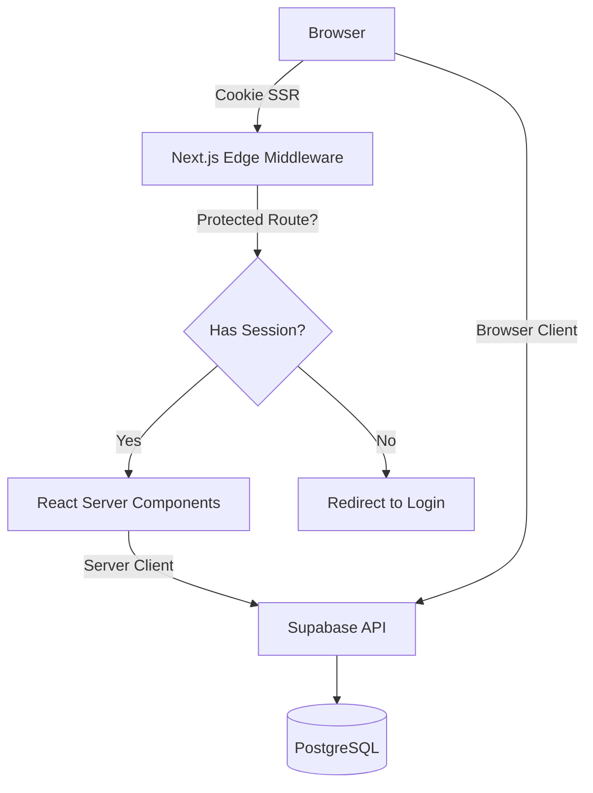
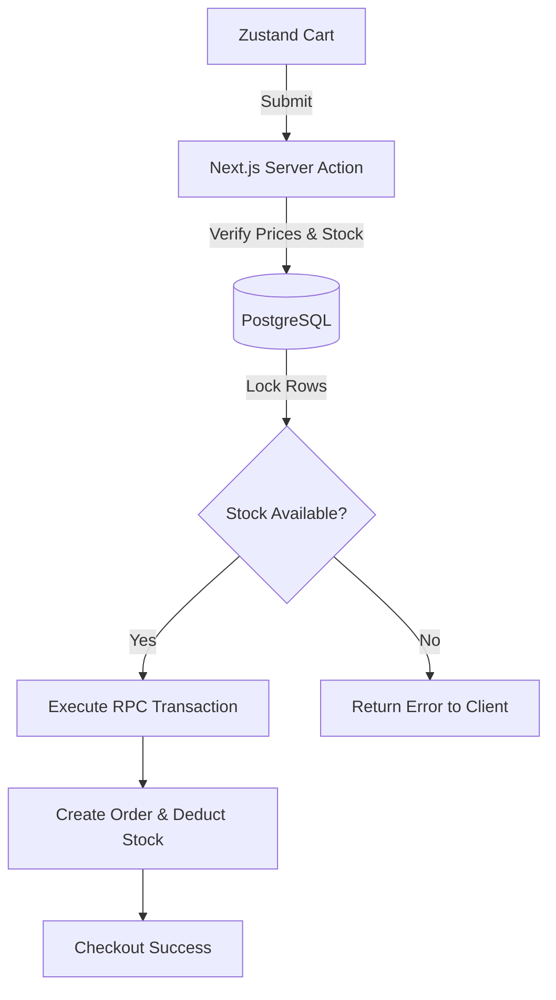
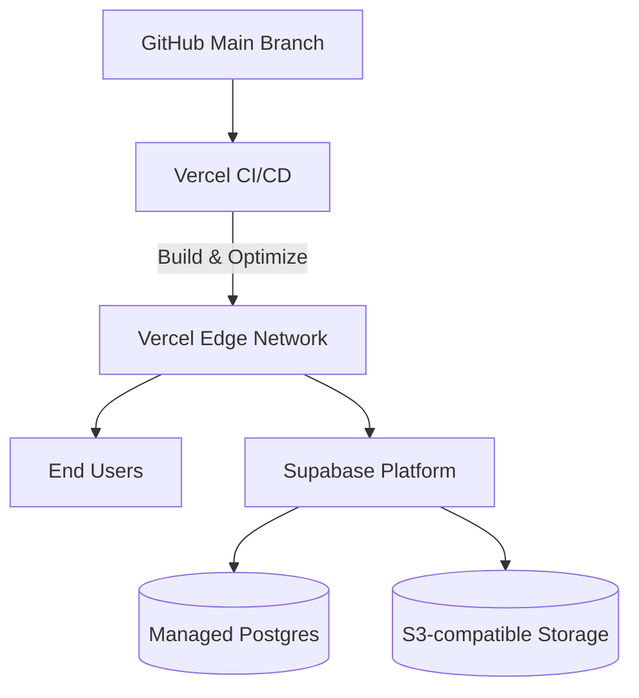

# 7TH SOUTH STREET: Software Architecture Design

## Executive Summary
This document outlines the final software architecture for 7TH SOUTH STREET (7SS), finalizing the transition to a modern Next.js and Supabase ecosystem. All legacy PHP/MySQL/JWT infrastructure has been explicitly identified as architectural duplication and fully removed from the deployment pipeline and repository.

---

## Next.js Application Architecture
The frontend leverages the **Next.js App Router** for optimal performance, utilizing React Server Components (RSC) by default.
- **Server and Client Component Boundaries:**
  - **Server Components:** Used for data-fetching, layout structures, and SEO metadata. Pages fetching products, categories, and inventory securely run on the server.
  - **Client Components:** (`'use client'`) Used exclusively for interactive UI fragments (e.g., shopping cart drawers, image galleries, complex forms with Framer Motion animations) and Zustand state management.
- **Cookie-Based SSR Authentication:**
  - Supabase uses secure HttpOnly, SameSite=Lax cookies to maintain sessions across server and client boundaries.
- **Middleware / Request-Proxy:**
  - `middleware.ts` runs on the edge to inspect Supabase cookies for authorization on protected routes (like `/account` and `/admin`). It intercepts unauthenticated requests and seamlessly redirects them, while also refreshing expired access tokens.

---

## Supabase Client Architecture
- **Supabase Browser Client (`@supabase/ssr`):** 
  - Created within Client Components to handle interactive features like login submissions, cart manipulations (if persisted), and client-side realtime subscriptions if needed.
- **Supabase Server Client:** 
  - Created dynamically in Server Components, Route Handlers, and Server Actions utilizing the Next.js `cookies()` API.

---

## PostgreSQL Database Architecture & Security
- **Database Engine:** PostgreSQL hosted via Supabase.
- **Row Level Security (RLS):** 
  - Strict policies restrict access to tables. Customers can only read/update their own `profiles`, `customers`, and `orders` data (using `auth.uid() = user_id`).
  - Administrators are governed by the `is_admin()` custom Postgres function, granting full access.
- **Inventory Reservation and Deduction:** 
  - Utilizes PostgreSQL transactions via RPC functions to ensure stock levels do not enter negative balances during concurrent checkouts. 

---

## Feature Architectures
- **Cart State:** Managed primarily on the client using **Zustand** (with optional local storage persistence) to ensure immediate UI feedback.
- **Checkout Processing:** Next.js Server Actions validate the Zustand cart state against the database source-of-truth before recording the final transaction. Guest checkout is supported alongside optional authenticated accounts.
- **Customer Account Data:** Synced securely between Supabase `auth.users` and `public.customers` via database triggers upon verified signup.
- **Supabase Storage (Product Image Delivery):** High-resolution assets are stored in Supabase Storage buckets with public read policies.
- **Pop-up RSVP Flow:** Server actions handle RSVP submissions and tie them to user profiles, preventing duplicate RSVPs.
- **Newsletter Flow:** Handled via Next.js Route Handlers utilizing a server-side rate-limiting salt (`NEWSLETTER_RATE_LIMIT_SALT`) to deter spam.
- **Email Notification Architecture:** Uses Supabase's native auth emails (integrated with Mailpit for local testing) and will scale using a transactional provider for post-checkout emails.
- **Analytics Data Flow & Observability:** Secure views/functions summarize data for the admin dashboard. Vercel Analytics and Supabase's built-in audit logging (`audit_logs` table) track platform health.

---

## Resolution of Architectural Duplication
During the codebase audit, an ongoing transition was identified between a legacy system and a modern system.
- **Removed Systems:** PHP 8 REST APIs, raw MySQL, and stateless JWT `localStorage` implementations.
- **Accepted Systems:** Supabase Auth (replaces JWT PHP logic), PostgreSQL (replaces MySQL), and `@supabase/ssr` cookie-based Server/Client auth (replaces Browser-only localStorage).
- *Result:* No competing backends exist. The Supabase/Next.js architecture is the undisputed source of truth.

---

## Architectural Diagrams

### 1. Application & Authentication Flow

### 2. Checkout & Inventory Flow

### 3. Deployment Architecture

